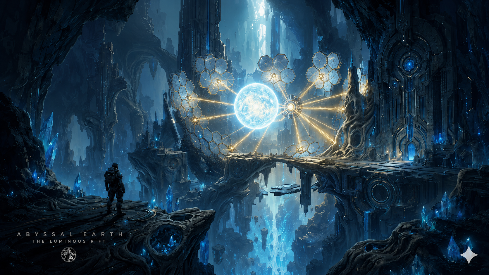
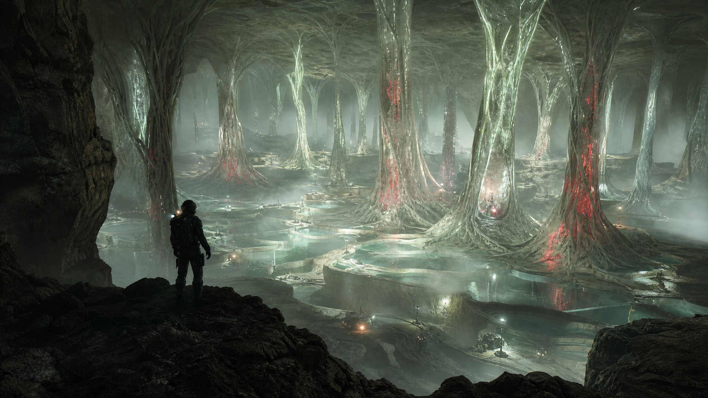
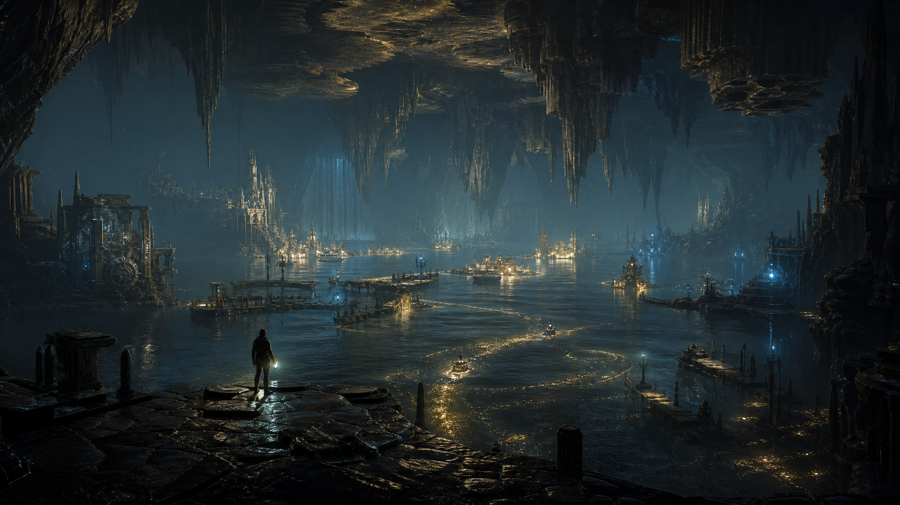
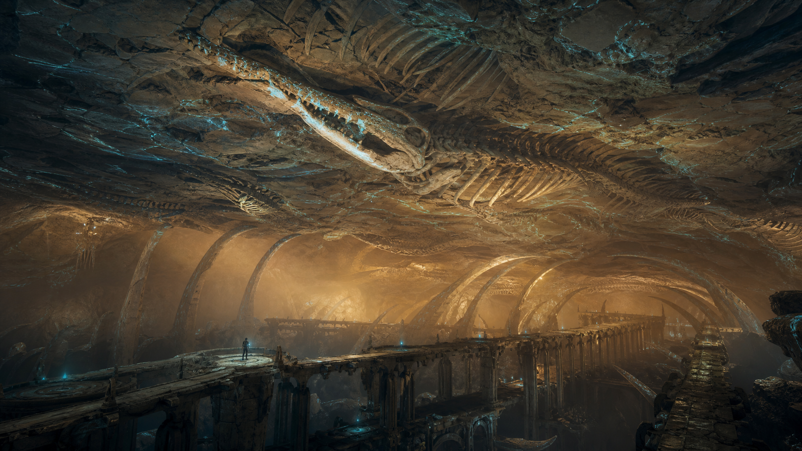
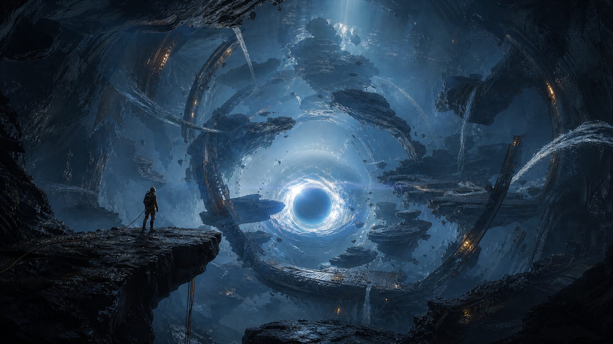
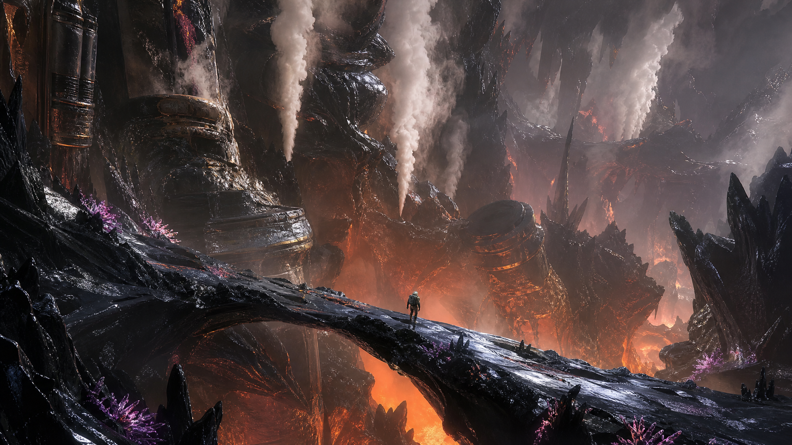

# Abyssal Earth

**Abyssal Earth** is an Unreal Engine 5 first-person survival-exploration adventure that begins with humanity's first major expedition into Earth's abyssal plains, then strands the player in impossible subterranean worlds filled with alien climates, monsters, ancient technology, luminous caverns, and unknown physical systems.

The project prioritizes awe, atmosphere, traversal, survival, discovery, and visual fidelity over shooter-first combat. The player is not conquering the underworld. They are trying to survive long enough to understand alien technology, learn to use it, build with it, and eventually create a rift back to the surface.

## Current Focus

The first playable map is **The Luminous Rift**: a colossal vertical cavern built around the core reference image above.

The target composition is a dark subterranean rift where carved rock and ancient machine architecture frame a suspended blue-white energy sphere. Gold beam networks connect the orb to hexagonal collector panels. Blue crystals grow from black basalt and buried machinery. Suspended bridges, ledges, distant towers, hanging slabs, and a monumental gate wall sell the sense that the player is tiny inside an ancient system far larger than the visible map.

This reference is treated as the source of truth for the first map:

`Content/ArtDirection/References/luminous_rift_core_reference.png`

## Design Pillars

1. **Beauty first**: every major space should be screenshot-worthy.
2. **Exploration over combat**: tension comes from scale, terrain, darkness, unknown systems, and environmental hazards.
3. **Discovery has weight**: scanning, naming, mapping, journaling, and revisiting findings should matter.
4. **Human smallness**: the player is capable, but visibly tiny against the cavern worlds.
5. **Natural mystery**: alien spaces should still feel geologic, ancient, and physically grounded.
6. **Story ends at the cavern**: after the opening crash and Luminous Rift reveal, normal dialogue/cutscene storytelling stops. The rest is survival, discovery, experimentation, and escape.

## Story Premise

The game opens with a submarine alone on a flat, empty ocean above Earth's abyssal plains. Inside, the player wears the diving/exploration suit they will upgrade throughout the game. A wall display reads **FIRST MAJOR EXPLORATION EXPEDITION OF EARTH'S ABYSSAL PLAINS** and explains that the autonomous Helios robot fleet has built an elevator shaft into the abyssal plain for human verification.

The player descends, docks with the shaft, passes humanoid Helios robots who warn of an unresolved anomaly, and enters the elevator anyway. The descent is calm until the system fails, the cable cuts, and the elevator falls. The player wakes in the crushed elevator, pries the doors open, and steps into the Luminous Rift.

The player's final authored reaction is: **Oh... shit.**

The objective becomes **SURVIVE**. From there, normal story delivery is over.

The long-term objective arc becomes: survive, discover alien technology, understand how to use it, fabricate increasingly advanced devices, and eventually create a rift/portal back to the surface. End credits show the player making it out, the discoveries being announced, and future scientific progress.

## First Playable Route

The current vertical slice route is:

1. **Descent Elevator**: a recent human survey platform forced into black basalt.
2. **First Overlook**: the initial concept-art reveal of the Luminous Rift.
3. **Abyssal Approach**: broken rock ledges and ancient bridge spans descending into the void.
4. **Crystal Galleries**: blue crystals growing through carved wall panels.
5. **Collector Array**: the central energy orb, gold beams, hex collectors, and radial hub.
6. **Ancient Gate**: a monumental wall with circular blue-lit mechanisms.
7. **Second Sky Overlook**: the final reveal into an even deeper lower cavern.

The goal is a 10-15 minute playable slice with first-person traversal, scan/discovery interactions, deployable beacons, objective progression, atmospheric sound, and a strong visual payoff.

## World Atlas

Beyond the Luminous Rift, Abyssal Earth is planned as a descent through multiple impossible inner-Earth biomes. The full planning document is `Docs/WORLD_ATLAS.md`.

### Glassroot Forest

A living mineral forest of translucent root-columns, pearl terraces, shallow reflective pools, pale green bioluminescence, and red mineral sap. This map should feel like a biological cathedral and introduce scanner-reactive living systems.

### Inner Sea

A vast underground ocean with silver-black water, dark teal fog, gold plankton trails, drowned machine ruins, broken piers, and hanging mineral shelves. This map expands navigation scale and makes beacons feel essential.

### Fossil Sky

A dry cavern where gigantic fossilized creatures line the ceiling above suspended observation walkways, amber dust shafts, bone-white stone, black chasms, and cyan scanner-reactive fossil veins.

### Gravity Well

A spherical anomaly chamber where basalt platforms, crystal debris, and water ribbons float around a blue-white gravity core. This map is the long-term altered-gravity traversal target.

### Mantle Garden

A dangerous geothermal garden of black obsidian ridges, white steam columns, orange heat blooms, magenta mineral flowers, and ancient heat-resistant machinery. This is the main late-game environmental hazard map.

## Core Gameplay

- First-person movement with sprint, crouch, and future climb/mantle hooks.
- Scanner pulse that identifies discoveries and route-relevant anomalies.
- Discovery journal with entries for geology, structures, anomalies, biology, and human-made objects.
- Deployable navigation beacons with persistent save/load support.
- Objective chain guiding the player through the first Luminous Rift route.
- Environmental hazard foundations, currently including an Ember Vent actor prototype for future hazard zones.
- Monster and alien-climate survival pressure without turning the game into a shooter-first design.
- Alien technology discovery and fabrication path that eventually leads to a return rift.
- Later add-on: Abyssal Interface, a diegetic LLM-powered ancient terminal/interface for cryptic hints, lore fragments, warnings, and fabrication guidance once the core game is further along.
- Blueprint-ready UI hooks for scanner readouts, journal views, objective HUD, damage feedback, and discovery toasts.

## Current Technical Foundation

The C++ foundation lives under `Source/AbyssalEarth/`.

Implemented or scaffolded systems include:

- `AAbyssalExplorerCharacter`: first-person exploration pawn.
- `UScannerComponent`: scan targeting, line-of-sight filtering, discovery feedback hooks.
- `ADiscoveryActor`: placeable scan target with journal metadata and optional objective completion.
- `UDiscoverySubsystem`: discovery registration, category queries, save/load support, and new-discovery delegates.
- `UAbyssalJournalWidget`: UMG base class for the discovery journal.
- `UAbyssalScannerReadoutWidget`: UMG base class for scan feedback.
- `UObjectiveSubsystem`: route progression through the revised Luminous Rift objective chain.
- `AObjectiveTriggerActor`: map trigger volumes for objective completion.
- `ABeaconActor` and `UBeaconSubsystem`: persistent player navigation beacons.
- `AEmberVentHazard`: cyclical environmental hazard prototype.
- `UAbyssalGameplayLibrary`: Blueprint accessors for project subsystems.

## Asset Pipeline

The current asset plan is built for Claude Code + Blender MCP collaboration. Unreal Editor and Blender work is expected to happen primarily on the Windows side, while repo/docs/code support can happen from Linux/OpenClaw.

Generated concept art now lives under `Content/ArtDirection/Concepts/` and is organized by production use:

- `Characters/`: protagonist diver, Helios humanoids, and creature silhouette references.
- `Environments/`: descent shaft, crashed elevator, bridge/platform kit, and machinery-detail references.
- `Intro/`: submarine exterior/interior and expedition-wall visual references for the opening sequence.
- `Items/`: blue crystal harvestable, ancient terminal/fabricator, expedition props, and item model toolkit references.

Key documents:

- `Docs/CORE_REFERENCE_LUMINOUS_RIFT.md`: detailed visual analysis of the first-map reference.
- `Docs/BLENDER_ASSET_PIPELINE.md`: asset-generation contract for Claude/Blender workers.
- `Docs/ART_DIRECTION.md`: visual target, palette, lighting, shape language, and what to avoid.
- `Docs/LUMINOUS_RIFT_BLOCKOUT.md`: route, scale, zones, placement checklist, and screenshot targets.
- `Docs/BLUEPRINT_IMPLEMENTATION_NOTES.md`: Windows/Unreal Editor instructions for the central orb, gold beam splines, hex collectors, scanner readout, journal, and objective HUD.
- `Docs/MATERIAL_SPECS.md`: master material targets and material instances.
- `Docs/NARRATIVE_FOUNDATION.md`: opening sequence, post-cavern story rules, main objective arc, and ending.
- `Docs/ABYSSAL_INTERFACE_AI_SYSTEM.md`: later add-on design for an LLM-backed in-game terminal/interface and backend contract.
- `Docs/WORLD_ATLAS.md`: long-term map roadmap with generated concept references.
- `Docs/CONCEPT_IMAGE_GENERATION.md`: prompt log for generated world-map concepts.
- `Content/Design/LuminousRiftAssetManifest.csv`: prioritized asset manifest.
- `Content/Design/LuminousRiftBlockoutChecklist.csv`: editor-trackable placement checklist for the first map.
- `Content/Design/WorldMapManifest.csv`: planned map manifest.
- `Content/Design/WorldAssetManifest.csv`: first-pass future-map asset manifest.
- `ArtSource/Blender/LuminousRift/ASSET_NOTES.md`: notes file for Blender-created assets.

Highest-priority asset families:

- Dark basalt foreground ledges, arches, walls, and overhangs.
- Ancient bridge/platform kit.
- Central orb frame, hub, beam emitters, and energy orb Blueprint proxy.
- Hex collector panels and broken cluster variants.
- Blue crystal clusters in small, medium, large, and hero sizes.
- Monumental ancient gate wall.
- Distant towers, hanging slabs, and lower-abyss silhouettes.
- Small human survey kit for scale.

## Setup

The project targets **Unreal Engine 5.4+**.

For a fresh Windows checkout:

1. Install Git LFS.
2. Clone the repository.
3. Run `git lfs install` once for the Windows user account.
4. Open `AbyssalEarth.uproject` in Unreal Editor.
5. Let Unreal generate project files and compile the `AbyssalEarth` module when prompted.
6. Create Blueprint children from the C++ classes in `Source/AbyssalEarth`.
7. Follow `Docs/MILESTONES.md` and `Docs/NEXT_TASKS.md` for the current vertical-slice priorities.

Do not commit generated Unreal folders such as:

- `Binaries/`
- `DerivedDataCache/`
- `Intermediate/`
- `Saved/`

Binary Unreal assets such as `.uasset` and `.umap` files are configured for Git LFS.

## Collaboration Workflow

Before starting work:

1. Run `git fetch --prune`.
2. Inspect `git status`.
3. Pull safely, preferably with `git pull --ff-only` when there are no local changes.

When finishing a coherent change:

1. Run the smallest useful verification available.
2. Commit with a focused message.
3. Push so the Windows/Unreal/Blender side can pull the update.

Never overwrite or revert unrelated work from the Windows side, Claude, or another contributor.

## Project Structure

- `Docs/`: design, art direction, technical plans, milestones, asset pipeline docs, and hourly logs.
- `Source/AbyssalEarth/`: Unreal C++ gameplay foundation.
- `Content/Design/`: CSV design data and asset manifests.
- `Content/ArtDirection/`: reference images and visual direction material.
- `Content/Maps/`: target location for playable maps.
- `Content/Blueprints/`: Blueprint children and interactables.
- `Content/Materials/`: master materials and material instances.
- `ArtSource/Blender/`: source files and notes for Blender-created assets.
- `Content/ArtSourceExports/`: interchange exports from Blender before Unreal import.

## Development Status

The project is early but active. The immediate push is asset production and playable game development: turn the Luminous Rift reference into an editor-built vertical slice with a coherent custom asset kit. Generated concept references are available for the opening sequence, character direction, early survival items, and Luminous Rift environment kits. The current foundation is strong enough to support map blockout, Blueprint wiring, scanner/discovery flow, objective progression, beacons, and first-pass visual development. The Abyssal Interface is documented as a future add-on, not an immediate priority.
